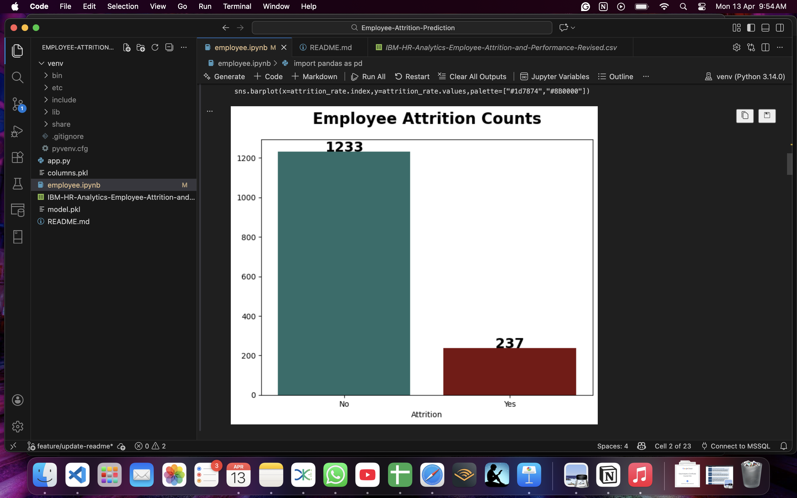
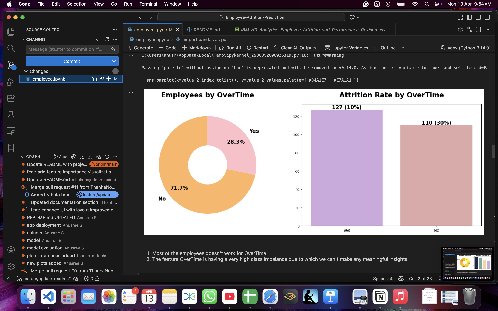
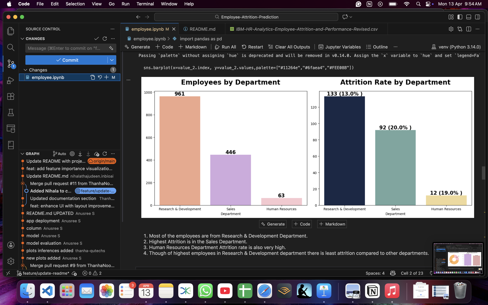
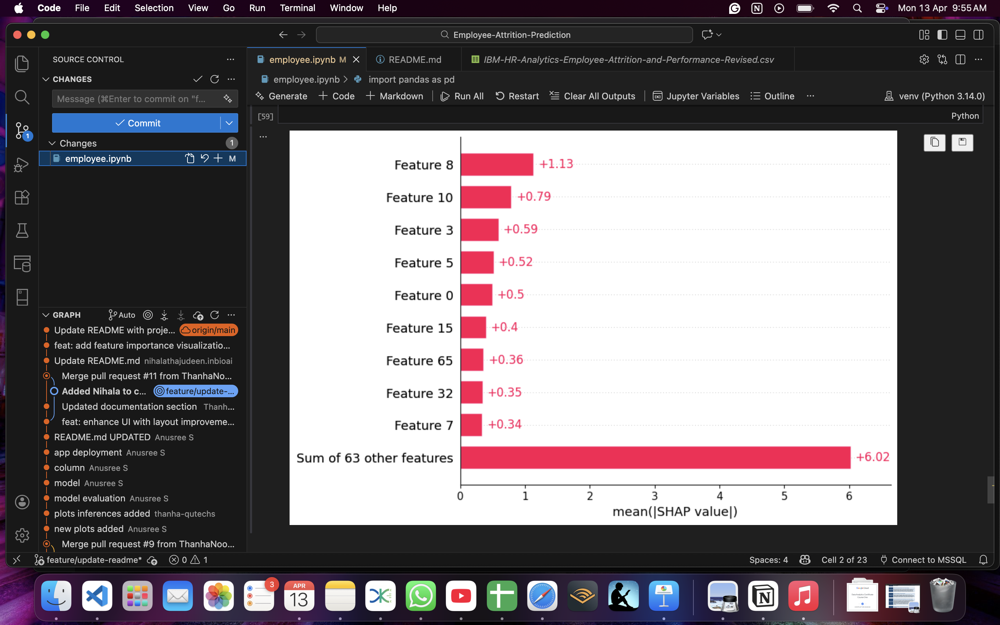

# Employee-Attrition-Prediction

Employee Attrition Prediction Using HR Analytics  
<<<<<<< HEAD
https://employee-attrition-prediction-eweicxxxfwzsqezsuuavwm.streamlit.app/
=======

>>>>>>> origin/featureeng
---

## Team Members

<<<<<<< HEAD
- Anusree S (MSc Computer Science - Data Analytics) 
- Thanha Noorudheen TT(MSc Data Analytics)  
- Nihala Thajudeen  (MSc Data Science - Bio Ai)

## 🎓 Course Details
- Course: Predictive Analytics
- Instructor: Prof. Aswin V S
- Institution: Digital University Kerala

---

# 📌 Problem Statement

Employee attrition is a major challenge for organizations as it leads to increased recruitment costs and loss of experienced talent.  

This project aims to predict whether an employee is likely to leave the company based on HR-related features such as Department, job satisfaction, overtime, salary, and years at the company.

---

# 🎯 Motivation

- Reduce employee turnover  
- Help HR take proactive decisions  
- Improve employee satisfaction  
- Save recruitment and training costs  

---

# 📊 Dataset Description

- **Dataset Name:** IBM HR Analytics Employee Attrition Dataset  
- **Source:** IBM Sample Dataset  
- **Size:** ~1470 records  
- **Features:** 30+ features  

### 🔑 Important Features:
- JobSatisfaction  
- OverTime  
- MonthlyIncome  
- YearsAtCompany  
- Department  

### 🎯 Target Variable:
- Attrition (Yes/No)

### ⚖️ Class Distribution:
- No (Stay): Majority  
- Yes (Leave): Minority  

---

# 🔄 Methodology (Data Science Life Cycle)

## 1. Problem Definition
Predicting employee attrition.

## 2. Data Collection
Used IBM HR Analytics dataset.

## 3. Data Preprocessing
- Handled missing values  
- Encoded categorical variables  
- Feature scaling  

## 4. Exploratory Data Analysis (EDA)
- Count plots  
- Salary vs Attrition analysis  

## 5. Feature Engineering & Selection
- Chi-Square Test  
- ANOVA (F-test)  

## 6. Model Building
- Logistic Regression  
- Decision Tree  
- XGBoost 
 ## Contributors
- Nihala Thajudeen – Feature engineering, model debugging, and testing

## 7. Model Evaluation
- Accuracy  
- Confusion Matrix  
- Classification Report  

## 8. Model Interpretation
- SHAP used for explainability  
- Identified key factors influencing attrition  

## 9. Deployment
- Built using Streamlit  
- User inputs → Prediction + Probability  
 

---

# 📈 Results Summary

| Model                | Accuracy |
|---------------------|---------|
| Logistic Regression | 90.4% ✅ (Best)    |
| Decision Tree       | 87.8%     |
| XGBoost             | 80.6%  |

Recall scores for: Logistic Regression: 0.35 | XGBoost: 0.23 | Decision Tree: 0.26

### 🔍 Key Insights:
- Overtime increases attrition  
- Low job satisfaction leads to higher attrition  
- Salary plays a major role  

---

# 📸 Application Screenshots
## 📊 Data Insights & Model Explainability

### Employee Attrition Overview


### Key Drivers: Overtime and Department



### Model Interpretability (SHAP)



---

# 🚀 How to Run Locally

## 🔹 Step 1: Clone Repository

```bash
git clone https://github.com/your-username/your-repo-name.git
cd your-repo-name
python3 -m streamlit run app.py
=======
- Anusree S  
- Thanha Noorudheen TT  
- Nihala Thajudeen  
>>>>>>> origin/featureeng
