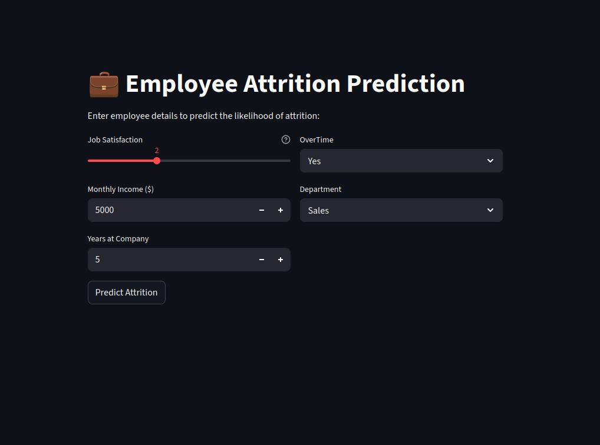
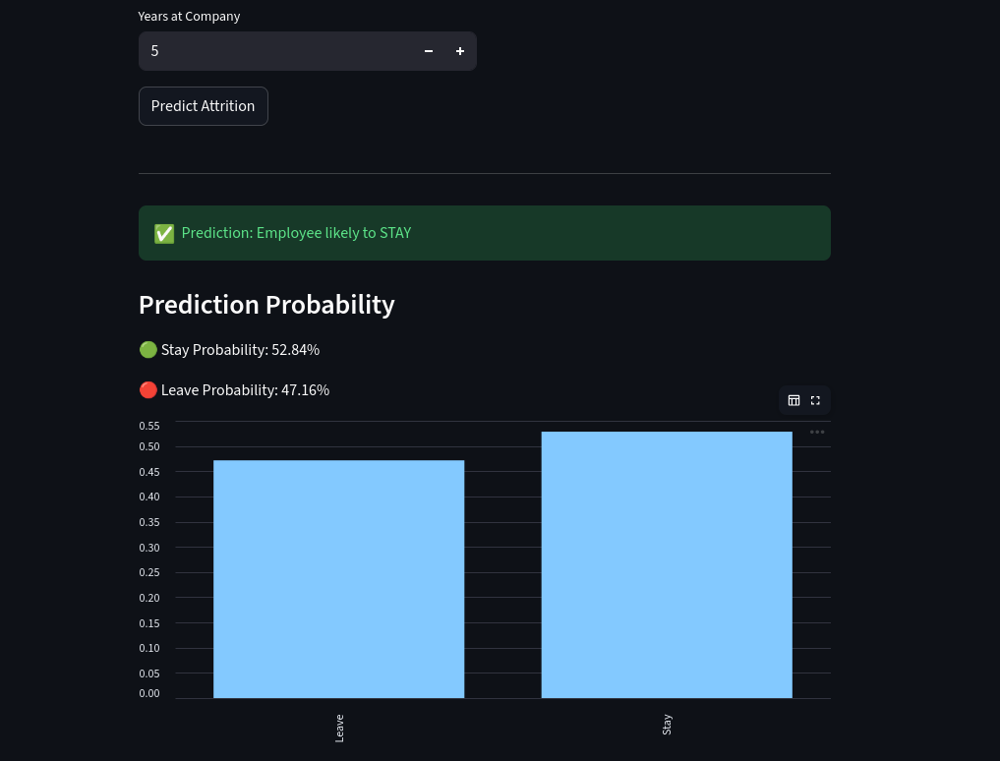
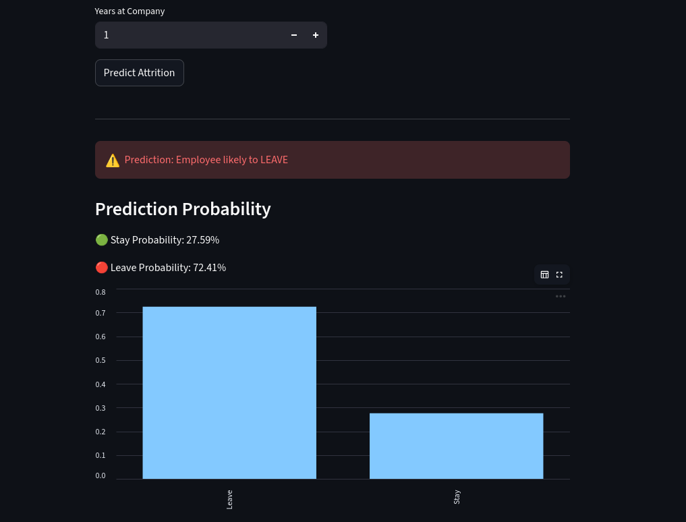

# Employee-Attrition-Prediction


Streamlit App link:

https://employee-attrition-prediction-eweicxxxfwzsqezsuuavwm.streamlit.app/
---

## Team Members

- Anusree S (MSc Computer Science - Data Analytics) 
- Thanha Noorudheen TT(MSc Data Analytics)  
- Nihala Thajudeen  (MSc Data Science - Bio Ai)

## 🎓 Course Details
- Course: Predictive Analytics
- Instructor: Prof. Aswin V S
- Institution: Digital University Kerala

---

# 📌 Problem Statement

Employee attrition is a major challenge for organizations as it leads to increased recruitment costs and loss of experienced talent.  

This project aims to predict whether an employee is likely to leave the company based on HR-related features such as Department, job satisfaction, overtime, salary, and years at the company.

---

# 🎯 Motivation

- Reduce employee turnover  
- Help HR take proactive decisions  
- Improve employee satisfaction  
- Save recruitment and training costs  

---

# � Project Structure

```text
.
├── screenshots/          # Application UI images
├── app.py                # Streamlit web application
├── employee.ipynb        # Data analysis and model training notebook
├── model.pkl             # Trained XGBoost model
├── scaler.pkl            # Feature scaler
├── columns.pkl           # List of features for consistency
├── requirements.txt      # Python dependencies
└── README.md             # Project documentation
```

# 🛠️ Tech Stack

- **Language:** Python 3.12+
- **Machine Learning:** Scikit-learn, XGBoost
- **Explainability:** SHAP
- **Dashboard:** Streamlit
- **Data Handling:** Pandas, NumPy
- **Visualization:** Matplotlib, Seaborn

---

# �📊 Dataset Description

- **Dataset Name:** IBM HR Analytics Employee Attrition Dataset  
- **Source:** [Kaggle / IBM Sample Dataset](https://www.kaggle.com/datasets/pavansubhasht/ibm-hr-analytics-attrition-dataset)
- **Primary Data File:** `IBM-HR-Analytics-Employee-Attrition-and-Performance-Revised.csv`
- **Size:** ~1470 records  
- **Features:** 30+ features  

### 🔑 Important Features:
- JobSatisfaction  
- OverTime  
- MonthlyIncome  
- YearsAtCompany  
- Department  

### 🎯 Target Variable:
- Attrition (Yes/No)

### ⚖️ Class Distribution:
- No (Stay): Majority  
- Yes (Leave): Minority  

---

# 🔄 Methodology (Data Science Life Cycle)

## 1. Problem Definition
Predicting employee attrition.

## 2. Data Collection
Used IBM HR Analytics dataset.

## 3. Data Preprocessing
- Handled missing values  
- Encoded categorical variables  
- Feature scaling  

## 4. Exploratory Data Analysis (EDA)
- Count plots  
- Salary vs Attrition analysis  

## 5. Feature Engineering & Selection
- Chi-Square Test  
- ANOVA (F-test)  

## 6. Model Building
- Logistic Regression  
- Decision Tree  
- XGBoost 

## 7. Model Evaluation
- Accuracy  
- Confusion Matrix  
- Classification Report  

## 8. Model Interpretation
- SHAP used for explainability  
- Identified key factors influencing attrition  

## 9. Deployment
- Built using Streamlit  
- User inputs → Prediction + Probability  

## 🚀 Model Serialization
The following artifacts are exported for deployment:
- `model.pkl`: Best performing XGBoost model.
- `scaler.pkl`: Robust Scaler for numerical features.
- `columns.pkl`: Ordered list of one-hot encoded features.
 

---

# 📈 Results Summary

| Model                | Accuracy |
|---------------------|---------|
| XGBoost             | 84.7% ✅ (Best) |
| Logistic Regression | 81.6%     |
| Decision Tree       | 78.2%     |

Weighted Average Recall: XGBoost: 0.85 | Logistic Regression: 0.82 | Decision Tree: 0.78

### 🔍 Key Insights:
- **Overtime** is the top predictor of attrition according to SHAP analysis.
- Stocks options and job involvement level also significantly impact attrition.
- Low monthly income and low job satisfaction correlates strongly with higher attrition rates.

---

# 📸 Application Screenshots
## 📊 Input form



### Prediction Visuals




---

# 🚀 How to Run Locally

## 🔹 Step 1: Clone Repository
```bash
git clone https://github.com/ThanhaNoorudheentt/Employee-Attrition-Prediction.git
cd Employee-Attrition-Prediction
```

## 🔹 Step 2: Install Dependencies
```bash
pip install -r requirements.txt
```

## 🔹 Step 3: Run the Application
```bash
streamlit run app.py
```

